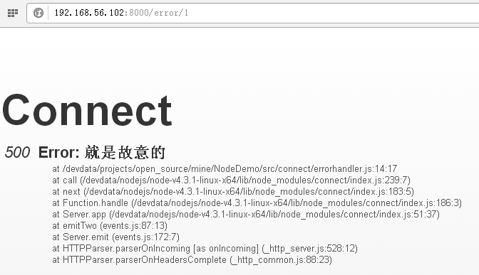

#安装
1、全局安装
```bash
npm install -g errorhandler
```

2、本地安装
```bash
npm install errorhandler
```

#使用
```node
var serverIndex = require("errorhandler");
```

#API
##errorhandler(options)
`仅用于开发模式`的错误处理。
###options参数说明

**log**
有3种处理模式：

* `true` 使用`console.error(str)`输出日志
* `false` 仅将错误信息发送至响应中
* `函数` 使用自定义函数处理错误（注：该函数在响应写完后才会调用），函数格式`log(err, str, req, res)`：
    * `err` 为`Error`对象
    * `str` 为错误信息
    * `req` 请求对象
    * `res` 响应对象

#示例
[源码](errorhandler.js)
```node
/**
 * 错误处理。
 * 
 * @author NieYong<aofengblog@163.com>
 */

var http = require("http");
var port = 8000;
var connect = require("connect");
var errorhandler = require("errorhandler");

var app = connect();
app.use("/error", function(request, response, next) {
    var error = new Error("就是故意的");
    error.status = 500;
    next(error);
});
app.use(errorhandler({
    log : errorHandler
}));

// 启动服务
http.createServer(app).listen(port);
console.log("http server with error handler started, listen port " + port);

function errorHandler(err, str, request, response) {
    var title = "URL：" + request.url + ", Method：" + request.method + " occurs error.";
    console.error(title + str, err);
}
```

启动服务后，在浏览器中输入http://192.168.56.102:8000/error/1，控制台输同如下信息：
```
URL：/error/1, Method：GET occurs error.Error: 就是故意的
    at /devdata/projects/open_source/mine/NodeDemo/src/connect/errorhandler.js:14:17
    at call (/devdata/nodejs/node-v4.3.1-linux-x64/lib/node_modules/connect/index.js:239:7)
    at next (/devdata/nodejs/node-v4.3.1-linux-x64/lib/node_modules/connect/index.js:183:5)
    at Function.handle (/devdata/nodejs/node-v4.3.1-linux-x64/lib/node_modules/connect/index.js:186:3)
    at Server.app (/devdata/nodejs/node-v4.3.1-linux-x64/lib/node_modules/connect/index.js:51:37)
    at emitTwo (events.js:87:13)
    at Server.emit (events.js:172:7)
    at HTTPParser.parserOnIncoming [as onIncoming] (_http_server.js:528:12)
    at HTTPParser.parserOnHeadersComplete (_http_common.js:88:23) { [Error: 就是故意的] status: 500 }
```

注：当出现错误时，当前的Connect版本会在响应中输出类似上面的错误信息，插件`errorhandler`好象有点多余。


