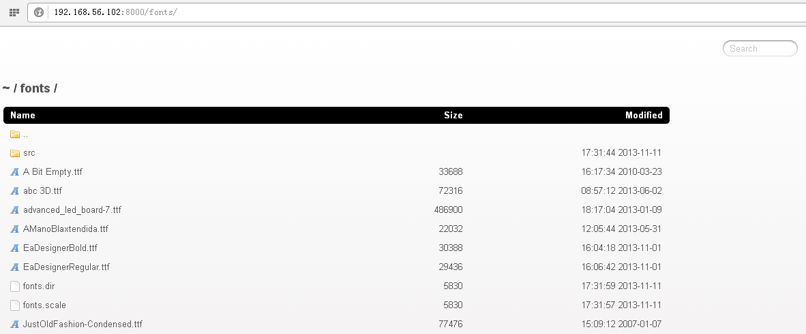

#安装
1、全局安装
```bash
npm install -g serve-index
```

2、本地安装
```bash
npm install serve-index
```

#使用
```node
var serverIndex = require("serve-index");
```

#API
##serveIndex(path, options)
给指定的目录(path)，生成目录列表。
###options参数说明
**filter**

应用于文件的过滤函数，对每个文件都起作用，调用形式：filter(filename, index, files, dir) 。参数说明：

* `filename` 文件名称
* `index` 文件在文件数组中的索引编号
* `files` 文件数组
* `dir` 文件所属目录的绝对路径

**hidden**

是否显示隐藏（.）文件。

默认值：false。

**icons**

是否显示图标。

默认值：false。

**stylesheet**

CSS样式表的路径。

默认值：内置的样式表。

**template**

用于渲染生成HTML的模板路径或函数。

默认值：内置的模板。

**view**

显示模式。`tiles`,`details`两种模式二选一或并存。

* `tiles` 只显示文件名称，分多列展示
* `details` 显示文件名称、大小和最近修改时间

默认值：tiles。

#示例
[源码](serve-index.js)
```node
/**
 * 目录列表。
 * 
 * @author NieYong<aofengblog@163.com>
 */

var http = require("http");
var port = 8000;
var connect = require("connect");
var serverStatic = require("serve-static");
var serverIndex = require("serve-index");

var app = connect();
app.use(serverStatic("/home/nieyong"));
app.use(serverIndex("/home/nieyong", {
    "icons" : true,
    "hidden" : false,
    "view" : "details"   // 默认为"tiles", 也可以是["tiles", "details"]
}));

http.createServer(app).listen(port);
console.log("http server with directory list started, listen port " + port);
```

效果如下：

